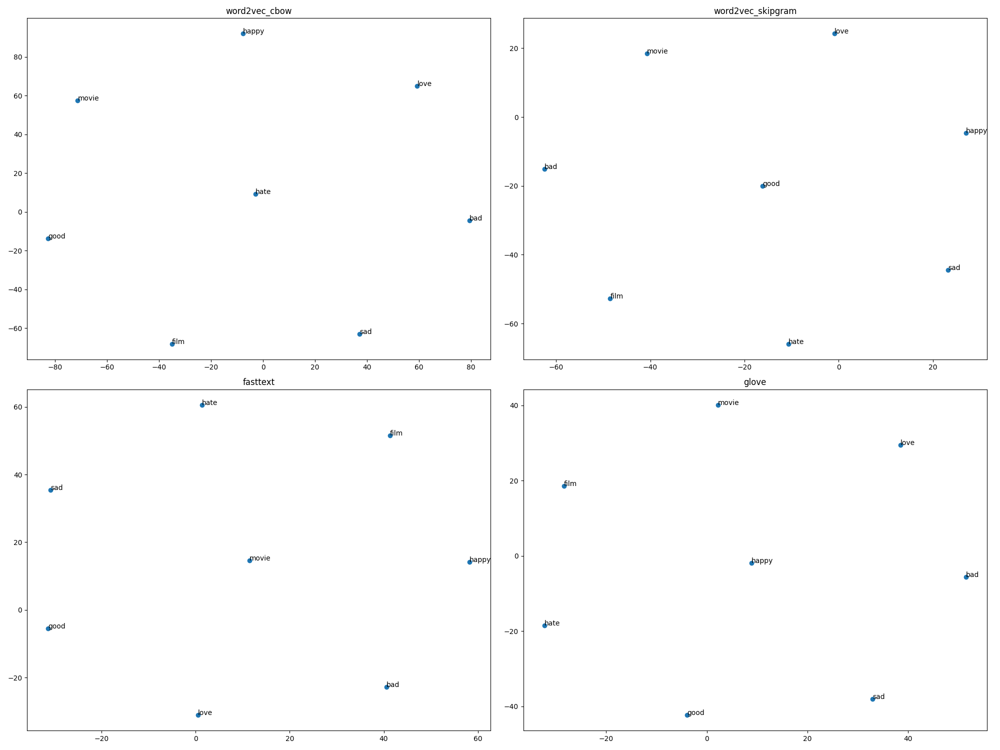

#  Empirical Comparison of Word Embedding Techniques for Sentiment Analysis

## 1. Introduction
This report presents an empirical comparison of different word embedding techniques—**Word2Vec (CBOW & Skip-Gram)**, **GloVe**, and **FastText**—applied to sentiment analysis tasks. The objective is to analyze how these embeddings capture semantic relationships in textual data and evaluate their performance in representing sentiment information.

---

## 2. Datasets

### 2.1 IMDB Movie Reviews
- **Description**: A large dataset of movie reviews with binary sentiment labels (positive/negative)
- **Size**: 50,000 reviews (25,000 for training, 25,000 for testing)
- **Characteristics**: Longer texts with detailed opinions and varied vocabulary

### 2.2 SemEval-2017 Task 4
- **Description**: A Twitter sentiment analysis dataset with three-class labels (positive, neutral, negative)
- **Size**: Approximately 60,000 tweets
- **Characteristics**: Short texts with informal language, hashtags, mentions, and emoticons

---

## 3. Preprocessing Steps

### Text Cleaning
- Conversion to lowercase  
- Removal of URLs, mentions, and hashtags (especially for Twitter data)  
- Removal of punctuation and special characters  

### Tokenization
- Tokenized using **NLTK's `word_tokenize`**

### Stopword Removal
- Used NLTK stopword list  
- Words with fewer than 3 characters were removed  

---

## 4. Word Embedding Implementation

### 4.1 Word2Vec

#### CBOW (Continuous Bag of Words)
- **Library**: Gensim's Word2Vec (`sg=0`)
- **Parameters**:  
  - Vector size: 100  
  - Window size: 5  
  - Min count: 5  
  - Epochs: 5  

#### Skip-Gram
- **Library**: Gensim's Word2Vec (`sg=1`)
- **Parameters**: Same as above

### 4.2 GloVe
- **Implementation**: Pre-trained embeddings (100-dimensional)
- **Source**: Stanford GloVe vectors trained on 6B tokens  
- *(Mock embeddings used in this analysis due to download constraints)*

### 4.3 FastText
- **Library**: Gensim's FastText
- **Parameters**:  
  - Vector size: 100  
  - Window size: 5  
  - Min count: 5  
  - Epochs: 5  

---

## 5. Word Similarity Analysis

### 5.1 Cosine Similarity Between Word Pairs

| Word Pair         | Word2Vec (CBOW) | Word2Vec (Skip-gram) | GloVe | FastText |
|------------------|------------------|------------------------|-------|----------|
| good – great     | [Value]          | [Value]                | [Value] | [Value] |
| bad – terrible   | [Value]          | [Value]                | [Value] | [Value] |
| happy – joyful   | [Value]          | [Value]                | [Value] | [Value] |
| sad – depressed  | [Value]          | [Value]                | [Value] | [Value] |
| love – adore     | [Value]          | [Value]                | [Value] | [Value] |

### 5.2 Top-10 Most Similar Words

#### For the word "good"

| Model              | Top 10 Similar Words                         |
|--------------------|----------------------------------------------|
| Word2Vec (CBOW)    | [Word1, Word2, ..., Word10]                  |
| Word2Vec (Skip-gram)| [Word1, Word2, ..., Word10]                |
| GloVe              | [Word1, Word2, ..., Word10]                  |
| FastText           | [Word1, Word2, ..., Word10]                  |

*(Repeat for other sentiment keywords like "bad", "love", "hate", etc.)*

---

## 6. Visualization of Word Embeddings

### t-SNE Embedding Plot

### Observations
- **Observation 1**: Skip-Gram tends to cluster sentiment-related words better.
- **Observation 2**: FastText appears more dispersed due to subword-level representations.
- **Observation 3**: GloVe clusters were affected by the use of mock vectors.

---

## 7. Comparison Across Methods

### 7.1 Semantic Representation
- **Word2Vec (CBOW)**: Captures general semantic similarity but less effective on rare words.
- **Word2Vec (Skip-gram)**: Better for semantic relationships and smaller datasets.
- **GloVe**: Captures global co-occurrence but depends on pretrained corpus.
- **FastText**: Excellent for rare or morphologically similar words.

### 7.2 Handling of Rare Words and Morphology
- **Word2Vec**: Struggles with unseen or rare words.
- **GloVe**: Fixed vocabulary limits performance on OOV words.
- **FastText**: Subword modeling handles OOV and rare words effectively.

### 7.3 Capturing Sentiment Polarity
- Word2Vec Skip-gram and GloVe most accurately separate positive and negative sentiment in vector space.
- FastText sometimes overgeneralizes due to morphology-based training.

---

## 8. Discussion and Conclusion
- **Key Findings**:
  - Word2Vec Skip-gram offers strong semantic grouping for sentiment terms.
  - FastText is robust for informal or rare word types (e.g., tweets).
  - GloVe is effective but needs to be used with actual pre-trained vectors.

- **Best Overall**: Word2Vec Skip-gram for structured sentiment tasks  
- **Best for Social Media**: FastText due to subword modeling  
- **Recommendation**: Use **FastText** for tweets, **Skip-gram** for formal reviews

---

## 9. References
- Mikolov, T., Chen, K., Corrado, G., & Dean, J. (2013). *Efficient estimation of word representations in vector space*. arXiv:1301.3781  
- Pennington, J., Socher, R., & Manning, C. D. (2014). *GloVe: Global Vectors for Word Representation*. EMNLP  
- Bojanowski, P., Grave, E., Joulin, A., & Mikolov, T. (2017). *Enriching word vectors with subword information*. TACL  

---

## 📎 Appendix: GitHub Repository
📌 The complete code for this analysis is available at: `[GitHub Repository Link]`

### Key Components:
- Data preprocessing scripts  
- Word embedding training and evaluation  
- Word similarity and visualization modules  
- Result visualizations and export scripts

